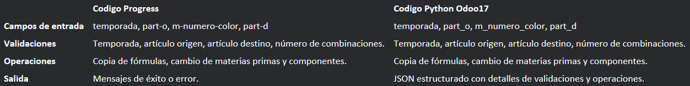

# Modulo Copia Ficha Tecnica (Receta).

## Alcance del modulo

Ingreso de materiales, temporadas y modelos para la creacion de ficha tecnica.
Copia de Ficha tecnica dependiendo de temporada, disponibilidad y disponibilidad de materiales. 

## Modelos 

### `receta.fichatecnica`
- Fields:
  - `fin_name` (Char)
  - `inicio_name` (Char)
  - `temporadas_id` (Many2one)
  - `articulos_id` (Many2one)
  - `numero_inicio_id` (Many2one)
  - `numero_fin_id` (Many2one)
  - `state` (Selection)
  - `componentes_ids` (Many2one)
  - `nombre_ficha` (Char)
  - `part_o` (Many2one)
  - `part_d` (Many2one)
  - `m_numero_color` (Boolean)
  - `copia_temporadas` (Many2one)
  - `copia` (Boolean)
  - `m_modelo_o` (Char)
  - `m_modelo_d` (Char)
  - `no_combo_d` (Char)
  - `x_cuero` (Char)
  - `x_color` (Char)
  - `x_plnta` (Char)
  - `x_colfo` (Char)
  - `sequence` (Integer)
  - `mensaje` (Char)
  - `xcuero` (Char)

### `cl.product.componente`
- Fields:
  - `name` (Char)
  - `descripcion` (Char)
  - `umedida` (Char)
  - `componente_id` (Many2one)
  - `ficha_tecnica_id` (Many2one)
  - `codigosecuencia_id` (Many2one)
  - `compra_manufactura_id` (Many2one)
  - `compra_manufactura_name` (Char)
  - `cantidad_id` (Inteeger)
  - `factor_perdida_id` (float)
  - `costo_unitario_id` (Float)
  - `costo_ampliado_id` (Float)
  - `departamento_id` (Many2one)
  - `departamento_name` (Char)
  - `articulo_id` (Many2one)

### `copia.receta.fichatecnica`
- Fields:

_________________________________________________

### `Funciones Ficha Tecnica`

  - `_compute_nombre_ficha_` ()
  - `_onchange_temporadas_id` ()
  - `_onchange_articulos_id` ()
  - `create` ()
  - `write` ()
  - `success_action` ()
  - `unlink` ()
  - `link_components` ()
  - `estructura_sku` ()
  - `copia_rec_dev` ()
  - `obtener_numero_combinaciones` ()
  - `copia_numero` ()
  - `_cambia_componente` ()
  - `_crea_ficha_comp` ()
  - `_copia_color` ()
  - `_cambia_materia` ()
  - `_determinar_nuevo_componente` ()
  - `next_button` ()

### `Funciones componente`

  - `_compute_costo_ampliado` ()
  - `_onchange_componentes_ids` ()
  - `create` ()

### `Funciones copia fichatecnica`

  - `close_wizard` ()

_________________________________________________

### `Cuadro Comparacion "codigo progress-codigo python"`

